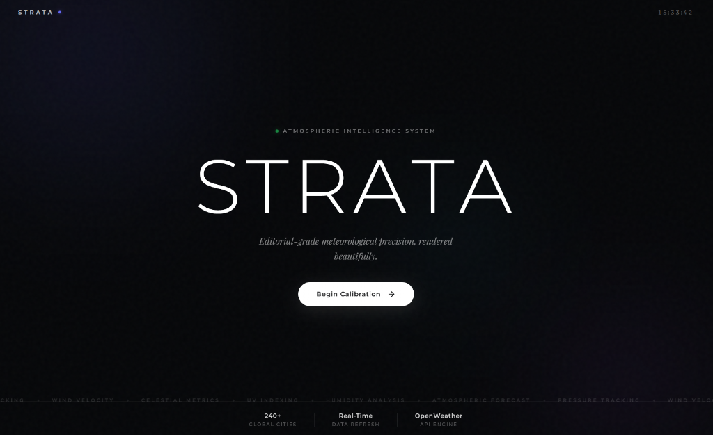
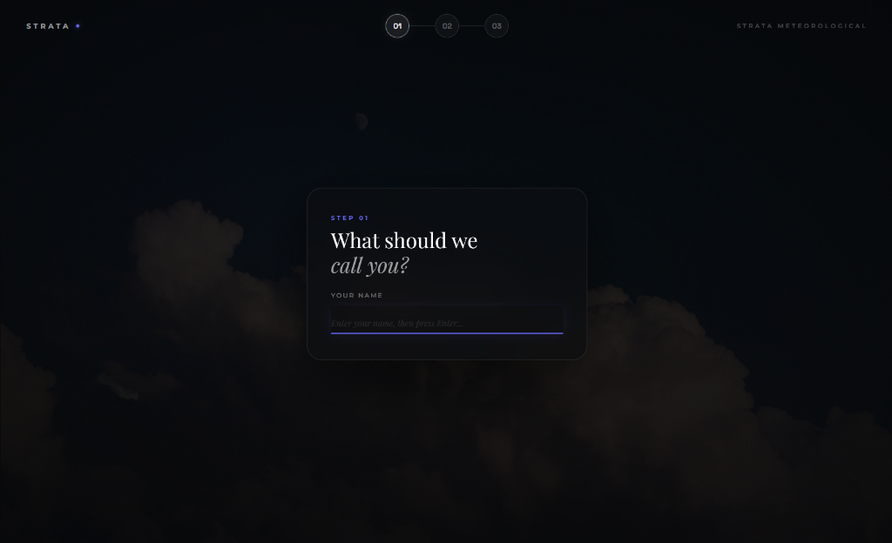
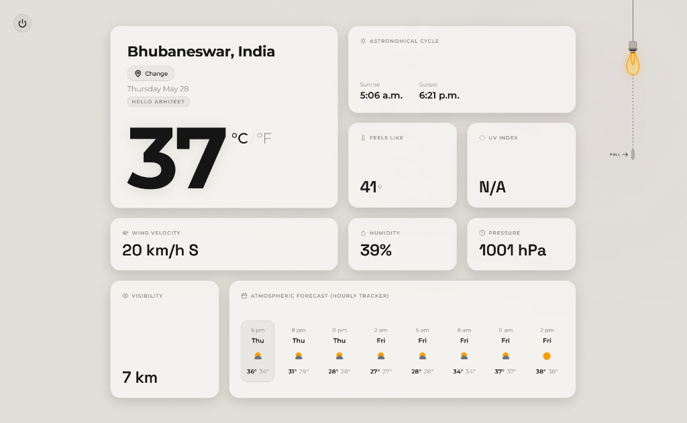
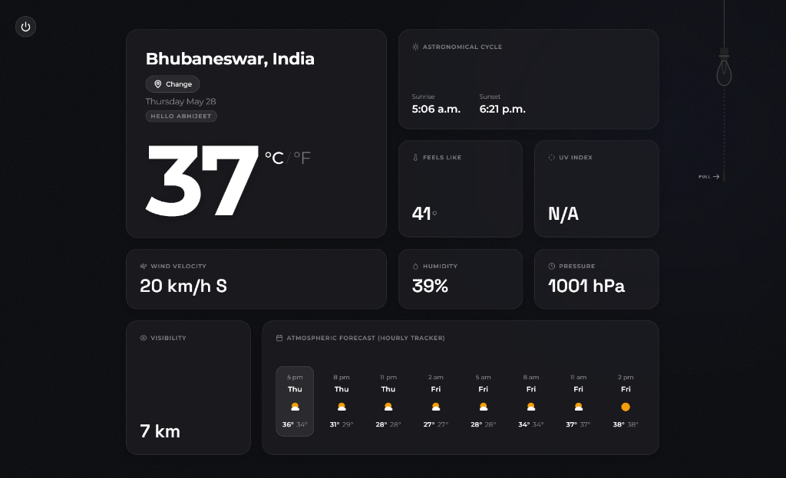

# 🌌 STRATA — Atmospheric Intelligence

> Editorial-grade meteorological precision, rendered beautifully.

**Strata** is a premium, high-aesthetic atmospheric intelligence application. Designed with modern typography, subtle micro-interactions, custom SVGs, and a tactile ceiling pull-cord physics-based theme switcher, it provides real-time global weather forecasts with uncompromised elegance.

---

## 📸 Interface Preview

### 1. Homepage
A cinematic entry portal initiating the atmospheric calibration process.

### 2. Setup & Onboarding
An interactive terminal interface guiding the user through personalization and location settings with live API global verification.

### 3. The Dashboard

#### Light Mode
Clean, premium glassmorphism styling utilizing high-contrast editorial layouts.

#### Dark Mode
Sleek, low-light aesthetic featuring glowing gradients and ambient dark backdrops.

---

## ✨ Features

- **Secured API Delivery:** A Vercel Serverless Function proxy (`/api/weather`) encapsulates your OpenWeather API credentials safely on the server side, preventing client-side key exposure.
- **Tactile Light/Dark Toggle:** An interactive, mechanical spring pull-chain mechanism dynamically transitions between dark mode and light mode with synthesized mechanical click audio.
- **Dual Development Architecture:** Seamlessly falls back to local direct fetching if run locally outside of a Vercel runtime environment.
- **Micro-Meteorological Panels:** Detailed tiles tracking temperature, wind velocity, astronomical cycles (sunrise/sunset), feels-like temps, humidity, pressure, and visibility.
- **Comprehensive Forecasts:** Multi-slot hourly tracking along with responsive 6-day summaries styled cleanly for mobile layout viewports.

---

## 🚀 Live Access

Experience editorial-grade weather precision live in your browser:

[👉 Launch Strata Live](https://strata-beta.vercel.app/)

---

## 🔮 Updates Coming Sooooonnnnn... 🚀

While we wait for the next atmospheric shift, our meteorological supercomputers (and our heavily caffeinated developers) are cooking up some wild updates:

- ⚡ **Lightning Simulator:** For when the weather is too boring and you want to trigger artificial lightning strikes inside your browser window.
- 🌪️ **Tornado Chaser Mode:** Direct integration with storm chaser dashboard cams so you can feel the rush without the flying cows.
- 🪐 **Exoplanet Weather Support:** Ever wondered what the humidity is on Mars or Jupiter? We are calibrating interstellar sensors as we speak.
- 🐑 **Atmospheric Sheep Index:** A highly proprietary metric that accurately calculates how fluffy the cumulus clouds are today.

*Disclaimer: The above updates may or may not violate several laws of thermodynamics. Stay tuned!*
